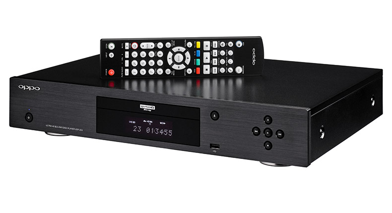
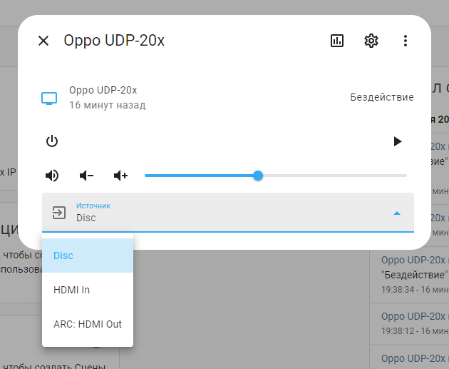
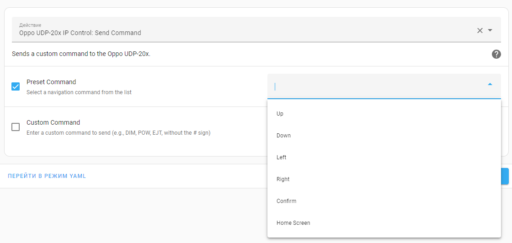

# Oppo UDP-20x IP Control Protocol

Custom Home Assistant integration for controlling Oppo UDP-20x series media players (e.g., UDP-203, UDP-205) via IP Control Protocol.


## Features
- **Power Control**: Turn the player on or off.
- **Volume Control**: Adjust volume (0-100), increase/decrease, mute/unmute. Volume displays both as a percentage (0.0-1.0) and in Oppo's native range (0-100).
- **Playback**: Play, stop, pause, skip to next or previous track.
- **Navigation**: Up, Down, Left, Right, Enter, and Home buttons via service calls.
- **Source Selection**: Switch between Disc, HDMI In, and ARC: HDMI Out directly from the media player card.
- **Status Polling**: Real-time updates for power, volume, mute, and playback status.

## Attributes
The integration provides the following extra state attributes for use in automations:
- `up`: "Move cursor up"
- `down`: "Move cursor down"
- `left`: "Move cursor left"
- `right`: "Move cursor right" 
- `enter`: "Select/Enter"
- `home`: "Return to home screen"
- `volume_level_oppo`: Current volume level in Oppo's native range (0-100)

Additional attributes displayed in the card:
- `volume_level`: Volume level as a percentage (0.0-1.0) for Home Assistant compatibility.
- `is_volume_muted`: Indicates if mute is active (true/false).
- `source`: Current input source (e.g., "Disc", "HDMI In").

## Installation
1. **Via HACS**:
   - Add this repository as a custom repository in HACS.
   - Install "Oppo UDP-20x IP Control Protocol".
2. **Manual Installation**:
   - Copy the `oppo_ipcontrol` folder to `/config/custom_components/`.
   - Copy `services.yaml` to `/config/` if you want the custom service UI (optional).
3. **Add Integration**:
   - Go to "Settings" → "Devices & Services" → "Add Integration".
   - Search for "Oppo UDP-20x IP Control Protocol" and configure with your device's IP (e.g., `192.168.1.XXX`).
4. **Restart Home Assistant**.

## Usage
- **Media Player Card**: Control power, volume, playback, and select input sources (Disc, HDMI In, ARC: HDMI Out)


- **Service Calls**: Use the `oppo_ipcontrol.send_command` service to send navigation or custom commands.
  - With `services.yaml`, you get a UI with a dropdown for preset commands (Up, Down, Left, Right, Confirm, Home Screen) and a text field for custom commands (e.g., DIM, POW, EJT).
  - Example in "Developer Tools":
    ```yaml
    entity_id: media_player.oppo_udp_20x
    preset_command: "up"
  - Or with a custom command":
    ```yaml
    entity_id: media_player.oppo_udp_20x
    custom_command: "POW"


## Notes
- Developed based on the official Oppo UDP-20x [IP Control Protocol commands from the RS-232 & IP Control Protocol.](OPPO_UDP-20X_RS-232_and_IP_Control_Protocol.pdf)
- Source selection supports Disc, HDMI In, and ARC: HDMI Out; additional sources are available in the protocol but not implemented here.

## Authors
Created by [@samsonovss](https://t.me/samsonovss) & xAI Assistant

