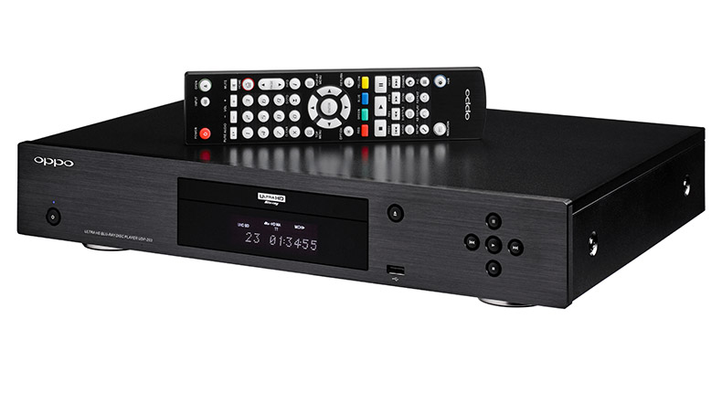
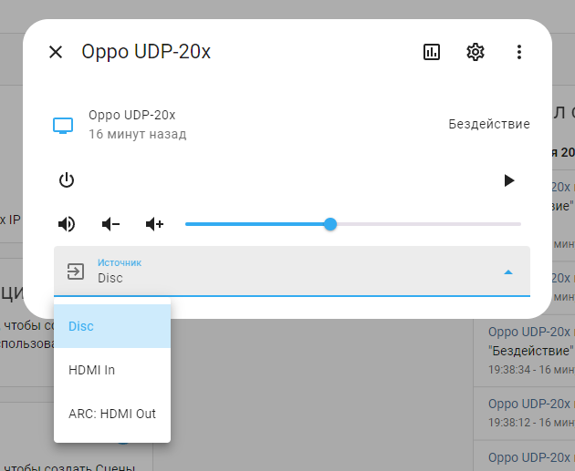
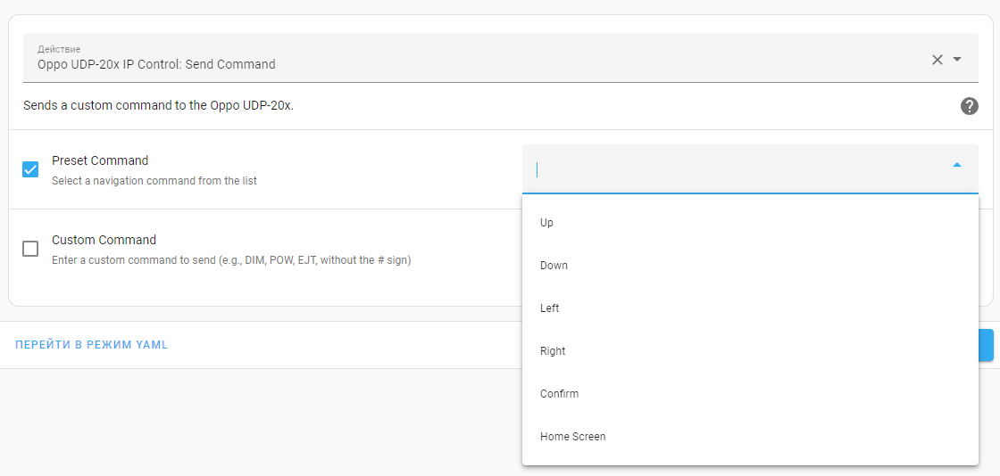

# Oppo UDP-20x IP Control Protocol

Custom Home Assistant integration for controlling Oppo UDP-20x series media players, such as the Oppo UDP-203 and UDP-205, over the local network using the official IP Control Protocol.



## Features

- **Power control**: Turn the player on or off.
- **Volume control**: Set volume, step volume up/down, and mute/unmute.
- **Playback control**: Play, stop, pause, next track, and previous track.
- **Navigation commands**: Up, Down, Left, Right, Enter, and Home via service calls.
- **Source selection**: Switch between Disc, HDMI In, and ARC: HDMI Out from the media player card.
- **Status polling**: Updates power, volume, mute, playback state, and selected source.
- **Config flow setup**: Add the player from the Home Assistant UI.
- **Options / reconfigure flow**: Change the player IP address from the integration settings without recreating the entity.
- **Multiple players**: Add each Oppo player as a separate integration instance.

## Supported devices

Designed for Oppo UDP-20x series players that support the Oppo RS-232 / IP Control Protocol:

- Oppo UDP-203
- Oppo UDP-205

Other compatible Oppo models may work if they implement the same protocol, but they are not explicitly tested.

## Installation

### HACS

1. Open HACS.
2. Add this repository as a custom integration repository.
3. Install **Oppo UDP-20x IP Control Protocol**.
4. Restart Home Assistant.
5. Go to **Settings → Devices & services → Add integration**.
6. Search for **Oppo UDP-20x IP Control Protocol** and enter your player's IP address.

### Manual installation

1. Copy `custom_components/oppo_ipcontrol` to `/config/custom_components/oppo_ipcontrol`.
2. Restart Home Assistant.
3. Go to **Settings → Devices & services → Add integration**.
4. Search for **Oppo UDP-20x IP Control Protocol** and enter your player's IP address.

## Changing the player IP address

If the player's IP address changes:

1. Go to **Settings → Devices & services**.
2. Open **Oppo UDP-20x IP Control Protocol**.
3. Use **Configure / Options / Reconfigure**.
4. Enter the new IP address.

The existing `media_player` entity should stay the same.

## Adding multiple players

To add another Oppo player, add the integration again from **Settings → Devices & services → Add integration** and enter the second player's IP address.

Each player is created as a separate Home Assistant config entry with its own `media_player` entity.

## Usage

### Media player card

Use the standard Home Assistant media player card to control power, volume, playback, and input source.



### Service calls

Use the `oppo_ipcontrol.send_command` service to send navigation or custom protocol commands.

With `services.yaml`, Home Assistant shows a service UI with preset commands:

- Up
- Down
- Left
- Right
- Confirm / Enter
- Home Screen

Example preset command:

```yaml
entity_id: media_player.oppo_udp_20x
preset_command: "up"
```

Example custom command:

```yaml
entity_id: media_player.oppo_udp_20x
custom_command: "POW"
```



## Attributes

The integration exposes extra state attributes that can be used in automations:

- `up`: Move cursor up
- `down`: Move cursor down
- `left`: Move cursor left
- `right`: Move cursor right
- `enter`: Select / Enter
- `home`: Return to home screen
- `volume_level_oppo`: Current Oppo volume level in the native `0-100` range

Additional media player attributes include:

- `volume_level`: Home Assistant volume level as `0.0-1.0`
- `is_volume_muted`: Whether mute is active
- `source`: Current input source, such as `Disc` or `HDMI In`

## Notes

- Developed using the official Oppo UDP-20x [RS-232 & IP Control Protocol](OPPO_UDP-20X_RS-232_and_IP_Control_Protocol.pdf).
- Source selection currently supports Disc, HDMI In, and ARC: HDMI Out.
- The protocol exposes more commands than this integration currently implements.

## Authors

Created by [@samsonovss](https://t.me/samsonovss) with help from **Тень**, an OpenClaw personal AI agent.
